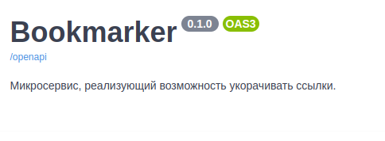

# Критичность багов

### Если страница не имеет title. - Medium
Случай, когда страница, link которых передаём в create bookmark не имеет title.
Были две идея исправления, либо чтобы возвращался None, либо пустая строка.
В случае с None надо было бы убрать ограничение в таблице bookmark на возможность NULL значения.
Я реализовал идею с пустой строкой, чтобы вносить меньше изменений в код.
Хотя мне кажется первая идея была бы лучше.

#### Исправление:
```python
def get_page_title(page_url: str) -> str | None:
    try:
        soup = BeautifulSoup(urlopen(page_url))
    except URLError:
        return None
    return soup.title.string if soup.title else ""
```


### Неверное описание сервиса. - Blocker
Описание сервиса не соответствует её функционалу.
Мне кажется неверное описание микросервиса, который делает совсем другое, чем он должен делать, является риском непрохождения ревью appstore.



### Нет ограничения длины пароля - Minor
Нет ограничения длины пароля.
Фактически при отправке следующей команды, всё выполнится, но всё же пароль из пустой строки не является надёжным.
```commandline
curl -X 'POST' \
  'http://127.0.0.1:8000/api/v1/user/registration' \
  -H 'accept: application/json' \
  -H 'Content-Type: application/json' \
  -d '{
  "username": "username",
  "password": "",
  "email": "user@example.com"
}'
```

#### Исправление:
registration.py:
```python
    @validator("password")
    def validate_password(cls, password):
        if len(password)<8:
            return ""
        settings = get_settings()
        password = settings.PWD_CONTEXT.hash(password)
        return password
```
database.py:
```python
async def register_user(session: AsyncSession, potential_user: RegistrationForm) -> tuple[bool, str]:
    if potential_user.password == "":
        return False, "The password is too short. The minimum password length should be 8"
    user = User(**potential_user.dict(exclude_unset=True))
    session.add(user)
    try:
        await session.commit()
    except exc.IntegrityError:
        return False, "Username already exists."
    return True, "Successful registration!"

```
